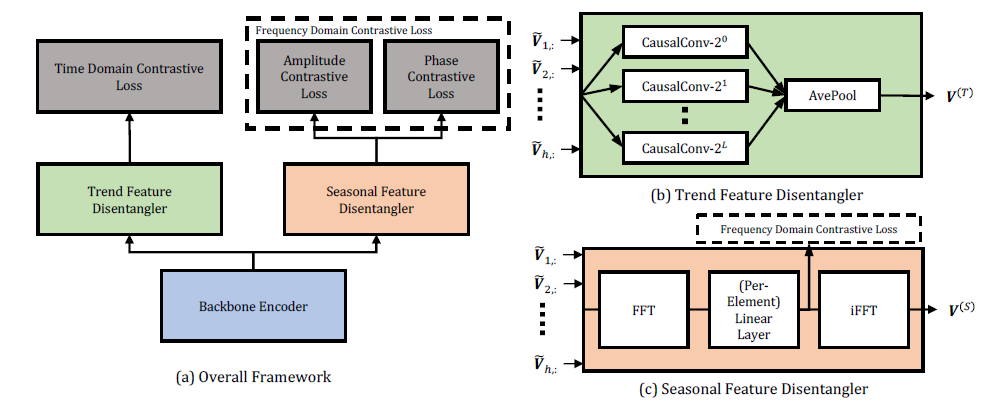
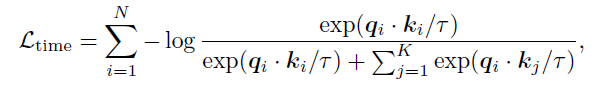
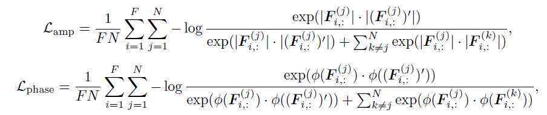

# CoST: Contrastive Learning of Disentangled Seasonal-Trend Representations for Time Series Forecasting

## 整体结构

区别于传统的端到端训练的神经网络模型来解决时间序列预测问题，本文提出的模型首先从数据中抽取高维度的表征，然后用最后一个时间步的表征输入到下游的回归模型中，进行时间序列预测。

本文首先假设观察到的时间序列数据X是由误差变量E，趋势变量T和季节性变量S产生的，然后分别学习T和S的表征。

本文提出了一个季节性和趋势性的对比学习框架，其目的是为输入的时间序列的每一个时间步都分别学习一个季节表征和趋势表征。模型结构图如下图。首先将时间序列输入给一个骨干网络将之进行编码并映射到更高的维度，之后分别利用趋势表征的学习模块（TFD）和季节表征的学习模块（SFD）来分别学习两个表征，且设计了3个不同的训练loss，模型通过3个loss的加权融合进行端到端的训练，最后两个模块的表征拼接即得到最终的数据表征。

模型结构图：

## 数据增强

缩放、平移和抖动

## 骨干网络

TCN/LSTM/Transformer

## 趋势表征

### 趋势特征分离（TFD）

使用L+1个1-D因果卷积（causal convolution）对输入进行编码，其中第i个卷积的卷积核大小为$2^i$。

最后对L+1个因果卷积的输出进行平均池化得到趋势表征。

### 时域对比学习

类似于MoCo，本文使用基于动量编码器获取正样本，带队列的动态字典获取负样本。对比学习的loss如下：

这里有N个样本和K个负样本，对于每一个TFD模块的输出，采样某一个时间步t做对比学习，并且使用MLP层做映射头以获取$q$，$k$是数据增强后的样本。

## 季节表征

### 季节特征分离（SFD）

使用离散傅里叶变换（DFT）来将输入映射到频率维度。

之后使用一个可学习的傅里叶变化，通过逐元素线性层per-element linear layer来实现。其在每个频率上进行仿射变换。

最后使用离散傅里叶逆变化将数据转化回到时间域。

### 频谱域对比学习

这里把频率用振幅和相位的表征进行表示，设计了2个对比学习loss：

## 回归模型

岭回归模型
